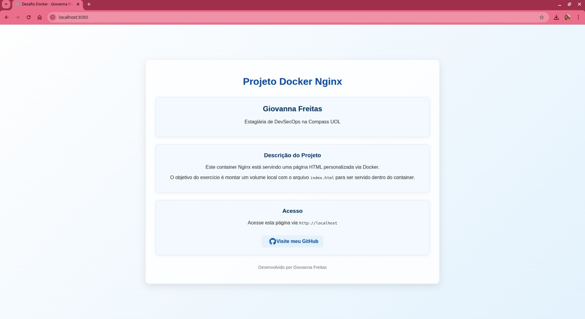

# Exercício 02 — Criando um container com Nginx

## Objetivo

Este exercício consiste em criar uma imagem Docker com o servidor web Nginx, servindo uma página estática HTML.


---

## Estrutura de diretório

```

docker-exercicio-02/
├── Dockerfile
├── index.html
└── README.md

````

---

## Dockerfile

```Dockerfile
FROM nginx:alpine
COPY index.html /usr/share/nginx/html/index.html
````

---

## Como utilizar

### 1. Construir a imagem

```bash
docker build -t meu-nginx .
```

### 2. Rodar o container

```bash
docker run -d -p 8080:80 meu-nginx
```

### 3. Acessar no navegador

Abra o navegador e acesse `http://localhost:8080` para ver a página HTML servida pelo Nginx.

---

## Resultado esperado

Uma página HTML simples sendo exibida no navegador com a mensagem desejada.

---

## Prints (adicione aqui as imagens que você tirar)

1. Estrutura de arquivos no terminal
2. Conteúdo do Dockerfile aberto no editor
3. Comando `docker build` rodando no terminal
4. Comando `docker run` e container rodando
5. Print da página no navegador

---

## Aprendizados

* Uso da imagem oficial do Nginx no Docker
* Como copiar arquivos para dentro da imagem Docker
* Como mapear portas entre o container e a máquina local
* Conceitos básicos de servidor web dentro de containers

---

## Referências

* [Nginx no Docker Hub](https://hub.docker.com/_/nginx)
* [Documentação oficial do Nginx](https://nginx.org/en/docs/)
