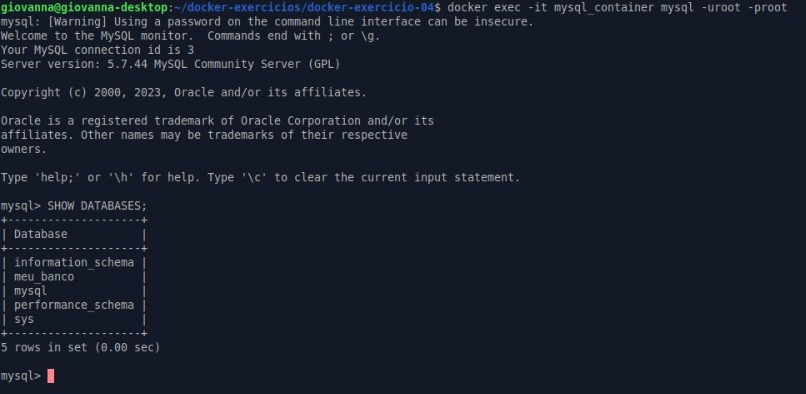

# Exercício 04 - Docker + MySQL com Volume

## Descrição

Este exercício consistiu em:

1. Subir um container MySQL (`mysql:5.7`)
2. Utilizar um volume nomeado para persistência de dados
3. Criar um banco de dados dentro do container
4. Parar o container e subi-lo novamente
5. Verificar se os dados persistiram corretamente

---

## Comandos Utilizados

### Criar volume:
```bash
docker volume create mysql_data
````

### Subir container:

```bash
docker run -d \
  --name mysql_container \
  -e MYSQL_ROOT_PASSWORD=root \
  -v mysql_data:/var/lib/mysql \
  -p 3306:3306 \
  mysql:5.7
```

### Acessar o MySQL:

```bash
docker exec -it mysql_container mysql -uroot -proot
```

### Criar banco de dados:

```sql
CREATE DATABASE meu_banco;
```

### Parar e subir novamente:

```bash
docker stop mysql_container
docker start mysql_container
```

### Verificar persistência:

```bash
docker exec -it mysql_container mysql -uroot -proot
SHOW DATABASES;
```

---

## Resultado

Após reiniciar o container, o banco de dados `meu_banco` ainda estava presente, comprovando que os dados foram persistidos com sucesso no volume nomeado.



