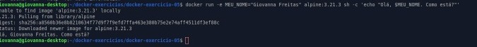

# Exercício 05 - Container Alpine com variável de ambiente


## Objetivo

Criar um container usando a imagem `alpine` que recebe uma variável de ambiente chamada `MEU_NOME`. 
O container deve imprimir o valor dessa variável utilizando o comando `echo`.

## Passos

1. Criar um Dockerfile que:
   - Use a imagem base `alpine`.
   - Configure a variável de ambiente `MEU_NOME` com seu nome.
   - Defina o comando padrão para imprimir o valor da variável com `echo`.

2. Construir a imagem com o nome `alpine-meu-nome`.

3. Executar um container a partir da imagem e verificar se a mensagem aparece corretamente.

## Comandos usados

```bash
docker build -t alpine-meu-nome .
docker run --rm alpine-meu-nome
