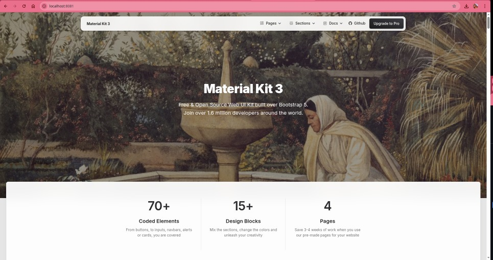

# Exercício 09 - Docker

## Descrição

Construção de uma imagem Docker baseada no Nginx para servir uma landing page estática moderna, utilizando um template do [Creative Tim](https://www.creative-tim.com/).

## Tecnologias Utilizadas

- Docker
- Nginx
- HTML/CSS/JS
- Template: [Material Kit](https://www.creative-tim.com/product/material-kit)

## Como Executar

### 1. Build da imagem

```bash
docker build -t minha-landing-page .
````

### 2. Executar o container

```bash
docker run -d -p 8081:80 minha-landing-page
```

### 3. Acessar no navegador

```
http://localhost:8081
```



