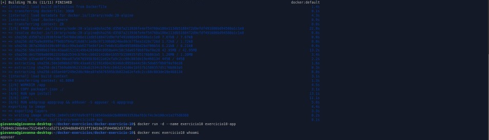

# Exercício 10 - Docker: Rodando Container com Usuário Não-root

## Objetivo

Criar uma imagem Docker para uma aplicação simples (script Python) que rode com um usuário não-root, evitando riscos de segurança ao executar containers com usuário root.

## Passos realizados

1. **Criação do usuário não-root no Dockerfile**

No Dockerfile foi criado um usuário chamado `appuser` usando o comando `useradd`:

```dockerfile
RUN useradd -m appuser
```

2. **Definição do usuário padrão para executar o container**

O usuário criado foi definido como padrão para execução do container com a instrução:

```dockerfile
USER appuser
```

3. **Construção da imagem**

A imagem foi construída com o comando:

```bash
docker build -t exercicio10-app .
```

4. **Execução do container**

O container foi iniciado a partir da imagem criada:

```bash
docker run -d --name exercicio10 exercicio10-app
```

5. **Verificação do usuário que está rodando o processo**

Para garantir que o container está rodando com o usuário `appuser`, foi usado o comando:

```bash
docker exec exercicio10 whoami
```

O resultado esperado é:

```
appuser
```

---

## Como rodar

1. Clone o repositório:

```bash
git clone https://github.com/oig04/desafio_docker.git
cd desafio_docker/docker-exercicio-10
```

2. Build da imagem:

```bash
docker build -t exercicio10-app .
```

3. Rodar o container:

```bash
docker run -d --name exercicio10 exercicio10-app
```

4. Verificar usuário dentro do container:

```bash
docker exec exercicio10 whoami
```


