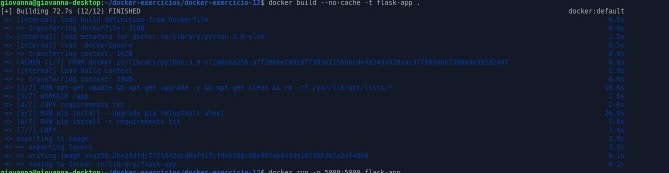
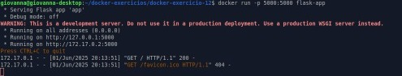
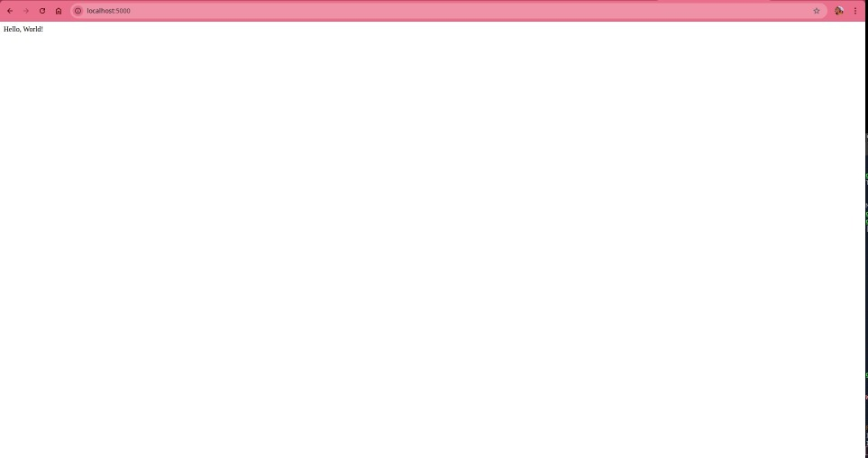

# Exercício 12 – Melhorando Dockerfile Vulnerável

Neste exercício, o objetivo foi identificar e corrigir vulnerabilidades presentes em um Dockerfile simples e inseguro, gerando uma imagem Docker mais segura, leve e com boas práticas.

---

## Contexto

O Dockerfile original usava uma imagem base genérica e grande (`python:3.9`), não atualizava pacotes do sistema, e rodava a aplicação como usuário root — tudo isso pode trazer riscos e imagens maiores que o necessário.

---

## Melhorias aplicadas

- **Imagem base menor**: Usei `python:3.9-slim` para reduzir o tamanho da imagem.
- **Atualização e limpeza do sistema**: Rodei `apt-get update && apt-get upgrade -y` e limpei caches para evitar vulnerabilidades e manter a imagem enxuta.
- **Usuário não-root**: Criei e usei um usuário `appuser` para rodar a aplicação, aumentando a segurança.
- **Atualização de dependências**: Atualizei o `requirements.txt` para versões mais recentes e seguras, incluindo `Flask` e `Jinja2`.
- **Otimização do build**: Organizei os comandos para melhor aproveitamento do cache do Docker e rapidez nas builds.
- **Upgrade do pip e setuptools**: Para garantir instalação correta e segura dos pacotes Python.

---

## Arquivos

### Dockerfile

```dockerfile
FROM python:3.9-slim

RUN apt-get update && apt-get upgrade -y && apt-get clean && rm -rf /var/lib/apt/lists/*

RUN useradd --create-home appuser

WORKDIR /app

COPY requirements.txt .

RUN pip install --upgrade pip setuptools wheel
RUN pip install -r requirements.txt

COPY . .

USER appuser

CMD ["python", "app.py"]
````

### requirements.txt

```text
Flask>=2.0.0
Jinja2>=3.1.6
```

### app.py

```python
from flask import Flask
app = Flask(__name__)

@app.route("/")
def hello_world():
    return "<p>Hello, World!</p>"
```

---

## Build da imagem

```bash
docker build --no-cache -t flask-app .
```

**Print do build:**


```
giovanna@giovanna-desktop:~/docker-exercicios/docker-exercicio-12$ docker build --no-cache -t flask-app .
[+] Building 72.7s (12/12) FINISHED
 => [internal] load build definition from Dockerfile ...
 ...
 => naming to docker.io/library/flask-app
```

---

## Execução do container

```bash
docker run -p 5000:5000 flask-app
```

**Output do container:**

```
 * Serving Flask app 'app'
 * Debug mode: off
WARNING: This is a development server. Do not use it in a production deployment. Use a production WSGI server instead.
 * Running on all addresses (0.0.0.0)
 * Running on http://127.0.0.1:5000
 * Running on http://172.17.0.2:5000
Press CTRL+C to quit
172.17.0.1 - - [01/Jun/2025 20:13:51] "GET / HTTP/1.1" 200 -
```


---

## Acesso

Abra no navegador [http://localhost:5000](http://localhost:5000) para ver a aplicação rodando.

---

## Considerações finais

Este exercício reforça a importância de construir imagens Docker de forma segura e eficiente, evitando o uso desnecessário do root, atualizando pacotes e limpando caches para reduzir vulnerabilidades e tamanho da imagem.
