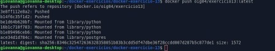
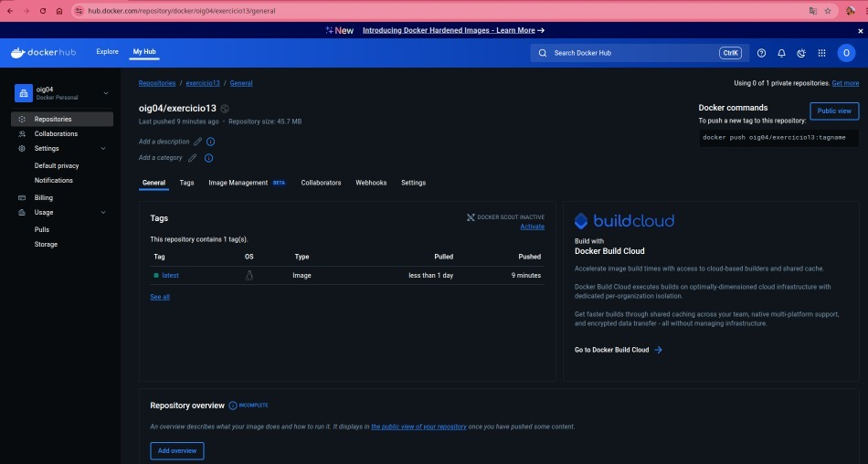

# Exercício 13 - Publicando imagem no Docker Hub

## Descrição

Neste exercício, criamos uma imagem Docker baseada em `python:3.11-slim` que copia um script Python simples para o container e imprime a data e hora atual. Depois, fazemos o build da imagem e a publicamos no Docker Hub.

---

## Estrutura do projeto

```
docker-exercicio-13/
├── Dockerfile
└── script.py
```

---

## Arquivos

### Dockerfile

```dockerfile
FROM python:3.11-slim

WORKDIR /app

COPY script.py .

CMD ["python", "script.py"]
```

### script.py

```python
from datetime import datetime

print("Data e hora atual:", datetime.now())
```

---

## Como rodar localmente

1. Faça o build da imagem:

```bash
docker build -t oig04/exercicio13:latest .
```

2. Rode o container:

```bash
docker run --rm oig04/exercicio13:latest
```

---

## Como publicar no Docker Hub

1. Faça login no Docker Hub usando um token pessoal (PAT):

```bash
echo "SEU_TOKEN_AQUI" | docker login -u oig04 --password-stdin
```

2. Envie a imagem para o Docker Hub:

```bash
docker push oig04/exercicio13:latest
```

---

## Link da imagem publicada

[Acesse sua imagem no Docker Hub](https://hub.docker.com/r/oig04/exercicio13)

---

## Resultado esperado

Ao rodar o container, o script Python imprime a data e hora atual no terminal.

---


> Imagem enviada com sucesso ao Docker Hub!

### Verificação no Docker Hub

A imagem está disponível publicamente em:

[https://hub.docker.com/r/oig04/exercicio13](https://hub.docker.com/r/oig04/exercicio13)
